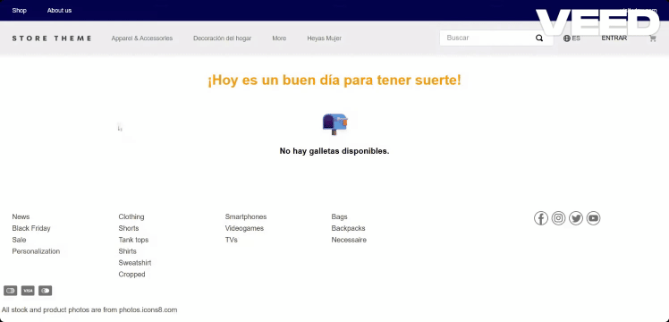

# Fortune Cookies VTEX App

Fortune Cookies es una aplicación para VTEX IO que muestra mensajes aleatorios de galletas de la fortuna y un número de la suerte en tu tienda. Los mensajes se almacenan en Master Data y la app es personalizable e internacionalizable.

---

## 

## 🚀 Instalación y despliegue

### 1. Clona el repositorio

```sh
git clone https://github.com/tu-org/fortune-cookies.git
cd fortune-cookies
```

### 2. Instala dependencias

```sh
cd react
yarn install
```

### 3. Ejecuta pruebas locales

```sh
yarn test
```

### 4. Despliega en VTEX IO

```sh
vtex login <account>
vtex use <workspace>
vtex link
```

---

## 🏗️ Arquitectura

- **react/**
  - **components/**: Componentes visuales y de UI.
  - **hooks/**: Custom hooks para lógica de negocio.
  - **interfaces/**: Tipos e interfaces TypeScript.
  - **services/**: Servicios para integración con Master Data.
  - **utils/**: Utilidades y helpers.
  - **mocks/**: Mocks para pruebas unitarias.
  - **styles/**: Archivos CSS y CSS Handles.
- **store/**: Declaración de bloques para VTEX Store Framework.
- **messages/**: Archivos de internacionalización (i18n).

---

## 🔗 Integraciones y Endpoints

### Master Data API

La app obtiene las galletas de la fortuna desde Master Data:

- **GET /api/dataentities/CF/search**
  - **Parámetros**:  
    `_fields=id,CookieFortune`, `_from=0&_to=99`
  - **Headers**:  
    `X-VTEX-API-AppKey`, `X-VTEX-API-AppToken`, `REST-Range`
  - **Ejemplo**:
    ```js
    fetch(
      '/api/dataentities/CF/search?_fields=id,CookieFortune&_from=0&_to=99',
      {
        method: 'GET',
        headers: {
          'X-VTEX-API-AppKey': '...',
          'X-VTEX-API-AppToken': '...',
          'Content-Type': 'application/json',
          Accept: 'application/json',
          'REST-Range': 'resources=0-400',
        },
      }
    )
    ```

### VTEX Styleguide

- Uso de componentes como Spinner para feedback visual.

### VTEX CSS Handles

- Permite personalización visual desde el Store Theme.

---

## 🎨 Personalización

Puedes modificar los mensajes de la fortuna en Master Data (entidad CF).  
Los textos son internacionalizables (`messages/`).  
Los estilos pueden personalizarse usando los siguientes CSS Handles:

| CSS Handle          | Descripción             |
| ------------------- | ----------------------- |
| container           | Contenedor principal    |
| containerInfo       | Info de contenedor      |
| cookieIcon          | Icono de galleta        |
| buttonSend          | Contenedor del botón    |
| mainButton          | Botón principal         |
| buttonDisabled      | Botón deshabilitado     |
| buttonEnabled       | Botón habilitado        |
| loadingContainer    | Contenedor de carga     |
| generatingContainer | Contenedor de selección |
| fortuneCard         | Tarjeta de fortuna      |
| fortuneTitle        | Título de fortuna       |
| fortuneText         | Texto de fortuna        |
| luckySection        | Sección de la suerte    |
| luckyNum            | Número de la suerte     |
| cookieId            | ID de la galleta        |

---

## 🧪 Pruebas

- Pruebas unitarias con Jest y React Testing Library.
- Módulos de VTEX mockeados para pruebas fuera de VTEX IO.
- Ejecuta `yarn test` en la carpeta `react`.

---

¿Dudas o sugerencias?  
Abre un issue o contacta al equipo de desarrollo.
Implementado por: Lennin Ibarra Desarrollador Frontend - ing.lenninibarra@gmail.com
